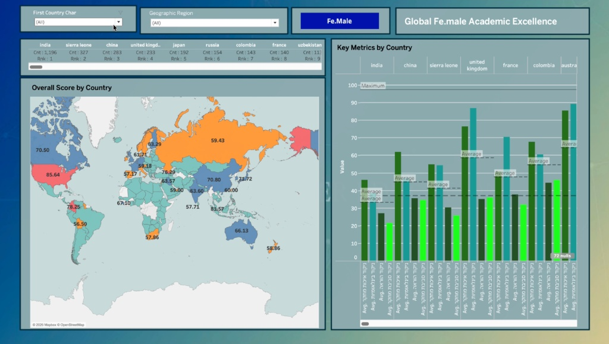
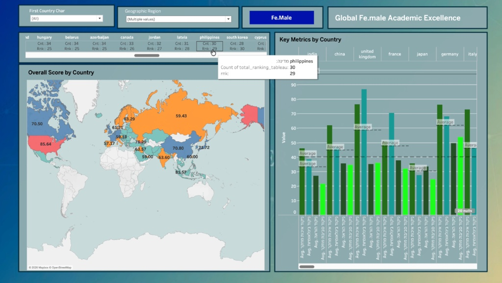
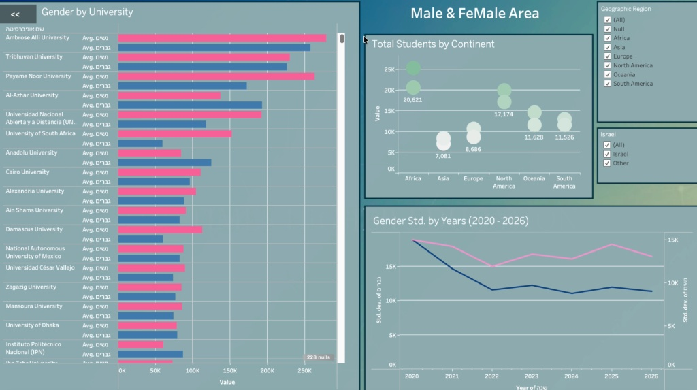
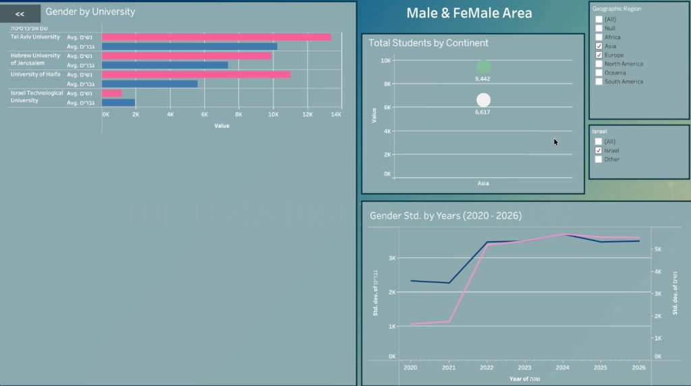

# 🎓 Global Female vs Male Academic Performance Dashboard (Tableau)

## 📊 Dashboard Previews

---

## 🧠 Overview

The **Global Female vs Male Academic Dashboard** presents a comprehensive, data-driven analysis of academic performance differences between genders across multiple countries and regions.

This project combines **statistical analysis, data preprocessing, and interactive visualization** to explore global education trends.  
It is designed for researchers, analysts, policymakers, and data enthusiasts who want to better understand patterns in academic achievement.

The dashboard enables dynamic exploration of:

- Gender-based academic performance comparisons  
- Cross-country educational metrics  
- Regional disparities and global trends  
- Longitudinal patterns in academic indicators  

---

## 🎯 Project Objectives

- Identify performance gaps between female and male students.
- Compare academic outcomes across countries and regions.
- Detect global and regional trends in educational metrics.
- Provide clear, interactive visual storytelling for decision-makers.

---

## 🔧 Key Features

### 📌 Interactive Filtering
- Filter by country, region, or academic indicator.
- Drill down into specific comparisons.
- Explore dynamic breakdowns by gender.

### 📊 Comparative Visualizations
- Side-by-side gender comparisons.
- Distribution analysis across countries.
- Trend-based insights over time.

### 🌍 Global Perspective
- Cross-country performance mapping.
- Identification of high-performing and low-performing regions.
- Regional clustering insights.

### 📈 Statistical Integration
- Data cleaning and preprocessing using Python.
- Structured datasets prepared in CSV/Excel format.
- Aggregations and calculated fields implemented in Tableau.

---

## 🛠 Tools & Technologies

- **Tableau Desktop / Tableau Public** – Dashboard creation and interactive visualization.
- **Python (Pandas, NumPy)** – Data preprocessing and transformation.
- **Excel / CSV** – Structured academic datasets.
- **Statistical Analysis Techniques** – Comparative metrics and aggregated indicators.

---

## 📂 Project Structure

── Globlal-Fe.Male-Academic/
            ├── Data/
            │   ├── 2020-2026_uns_rnk.csv
            │   └── 2020-2026_uns_rnk.xlsx
            │
            ├── Image/
            │   ├── image_1.jpeg
            │   ├── image_2.jpeg
            │   ├── image_3.jpeg
            │   └── image_4.jpeg
            │
            ├── Python_Analysis/
            │   ├── class_uns.py
            │   └── run_class_uns.py
            │
            ├── Globlal Fe.Male Academic.twb
            └── README.md

---

## 📊 Analytical Use Cases

### 🎓 Academic Research
- Study gender-based performance gaps.
- Identify educational inequality patterns.
- Support policy analysis.

### 🏛 Policy & Decision Making
- Assist governments and institutions in evaluating gender parity.
- Highlight regions requiring educational intervention.
- Provide evidence-based insights for funding allocation.

### 📈 Data Science Portfolio
- Demonstrates:
  - Data preprocessing workflow
  - Statistical comparison techniques
  - Business intelligence storytelling
  - Clean dashboard design principles

---

## 📌 Notes

- The dashboard file is provided as **`.twb` (Tableau Workbook)**.
- Requires **Tableau Desktop or Tableau Public** for interactive exploration.
- Ensure data sources in the `Data/` folder are correctly connected if opening locally.
- Python scripts in `Python_Analysis/` contain preprocessing logic used before visualization.

---

## 🔍 Methodology Summary

1. Data collection from structured academic datasets.
2. Cleaning and normalization using Python.
3. Aggregation of gender-based indicators.
4. Import into Tableau for visualization.
5. Interactive dashboard design for comparative analysis.

---

## 🚀 Future Improvements

- Integration of predictive modeling for academic trend forecasting.
- Inclusion of additional years and countries.
- Deployment to Tableau Public with live updates.
- Expanded statistical benchmarking.

---

## 👤 Author

**saharYaccov**  
Data Analyst | Information Systems | Machine Learning & BI  

📂 Project Path:  
`portfolio/DashBoards/Tableau/Globlal-Fe.Male-Academic/`

---

> This project highlights the power of combining statistical thinking, clean data engineering, and visual storytelling to uncover meaningful global insights.
